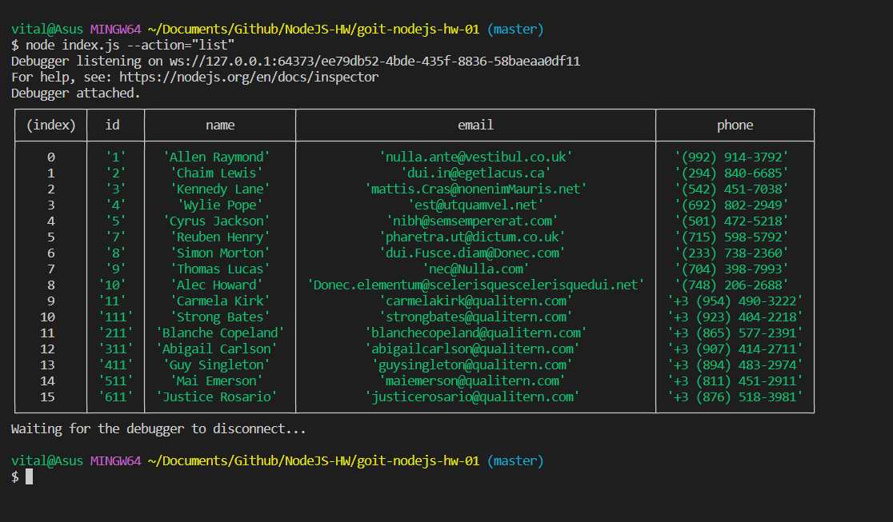
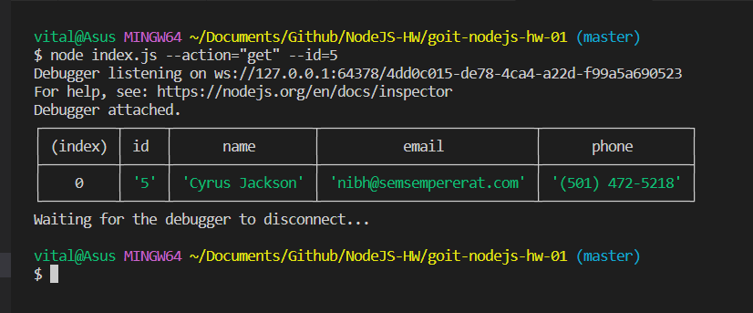

# Contacts CLI application

## Get contacts list from DB and output with console.table()

node index.js --action="list"

## Get contact with id #5 from DB

node index.js --action="get" --id=5

## Adding contact to DB

node index.js --action="add" --name="Mango" --email="mango@gmail.com" --phone="322-22-22"

## Remove contact whith id #3 from DB

node index.js --action="remove" --id=3

