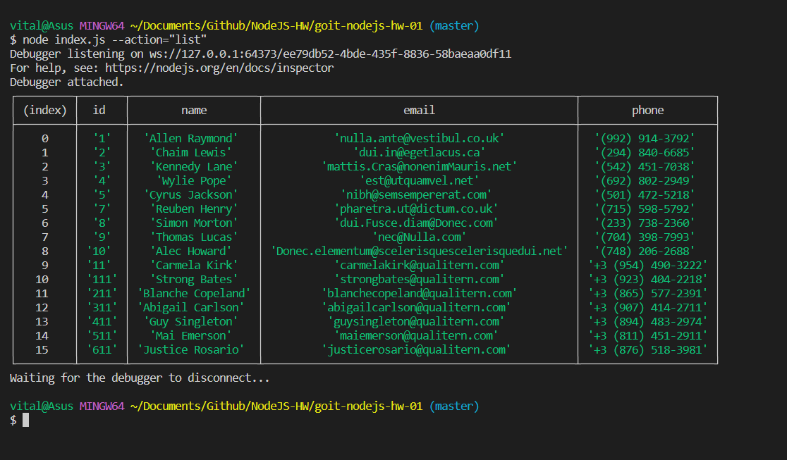
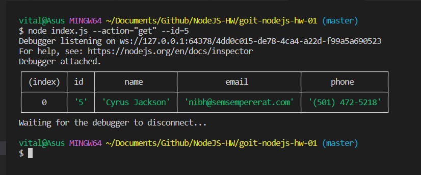
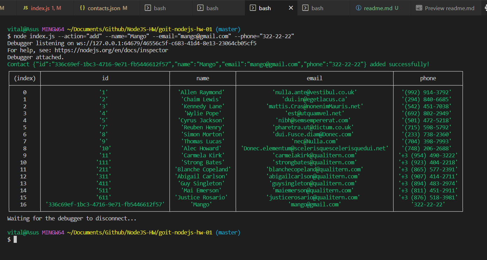
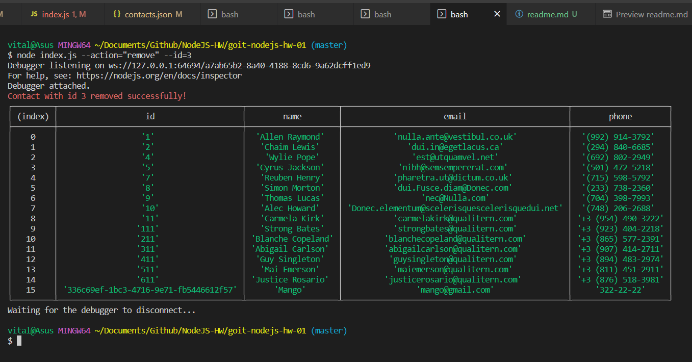

# Консольний телефонний довідник

## Отримуємо і виводимо весь список контактів у вигляді таблиці (console.table)

node index.js --action="list"

## Отримуємо контакт по id

node index.js --action="get" --id=5

## Додаємо контакт

node index.js --action="add" --name="Mango" --email="mango@gmail.com" --phone="322-22-22"

## Видаляємо контакт

node index.js --action="remove" --id=3

